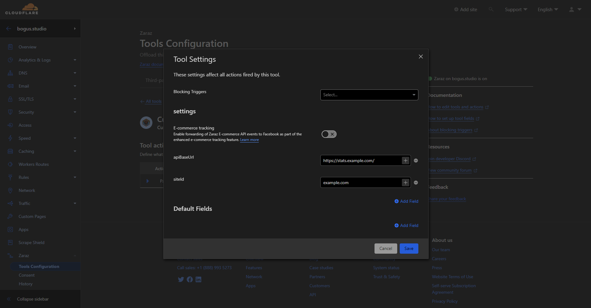

# Counterscale Managed Component

## 📖 Documentation
- How to deploy a custom Zaraz Managed Component: [Custom MC docs](https://developers.cloudflare.com/zaraz/advanced/load-custom-managed-component/#docs-content)
- The managed component assumes you have deployed [counterscale](https://github.com/benvinegar/counterscale) on the same Cloudflare Account as your MC and have left the default worker name as `counterscale`. There are no plans to support other worker names or external deployments at this time.

## ⚙️ Tool Settings
> Settings are used to configure the tool in a Component Manager config file

> ![NOTE]
> In Zaraz, you will need to manually add the "settings" fields making sure to use the correct field names. See the below screenshot:

### Site ID `string` _required_

`siteId` can be practically any string. It is used to identify the site in the Counterscale system. You can find it in the Counterscale dashboard.

### API Base URL `string` _required_

`apiBaseUrl` is the base URL of the Counterscale API. If you have Counterscale on its own domain it may look like `https://stats.example.com/`. If you have Counterscale on a route of your domain it may look like `https://example.com/api/counterscale/`. Either way, the URL should point to the Counterscale API with the `collect` endpoint.

## ⚒️ Building and Deploying
### With Actions
CI/CD GitHub Actions are setup to automate the build and deploy process. You will need to complete the following steps [based on the Workers docs](https://developers.cloudflare.com/workers/wrangler/ci-cd) to get it setup:
- Create an Actions secret called `CLOUDFLARE_API_TOKEN` with a Cloudflare API token that has permission to edit Workers (use the `Edit Workers` template)
- Create an Actions secret called `CLOUDFLARE_ACCOUNT_ID` with your Cloudflare account ID

## 📝 License

Licensed under the [Apache License](./LICENSE).
