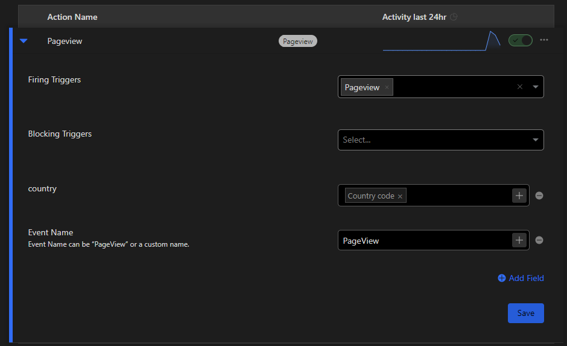

# Counterscale Managed Component

> [!IMPORTANT]  
> This branch is being refactored to incorporate changes I made to MC packaging tool which will make packaing for this project more seamless eliminating the weird `worker` directory. This will also allow for easier testing and development.

## 📖 Documentation
- How to deploy a custom Zaraz Managed Component: [Custom MC docs](https://developers.cloudflare.com/zaraz/advanced/load-custom-managed-component/#docs-content)
- The managed component assumes you have deployed [counterscale](https://github.com/benvinegar/counterscale) on the same Cloudflare Account as your MC and have left the default worker name as `counterscale`. There are no plans to support other worker names or external deployments at this time.

## ⚙️ Tool Settings
> Settings are used to configure the tool in a Component Manager config file

> [!NOTE]
> In Zaraz, you will need to manually add the "settings" fields making sure to use the correct field names. See the below screenshot:

### Site ID `string` _required_

`siteId` can be practically any string. It is used to identify the site in the Counterscale system. You can find it in the Counterscale dashboard.

### API Base URL `string` _required_

`apiBaseUrl` is the base URL of the Counterscale API. If you have Counterscale on its own domain it may look like `https://stats.example.com/`. If you have Counterscale on a route of your domain it may look like `https://example.com/api/counterscale/`. Either way, the URL should point to the Counterscale API with the `collect` endpoint.

## 🧱 Fields Description
> Fields are properties that can/must be sent with certain events

> [!NOTE]
> In Zaraz, you will need to manually add the action field settings making sure to use the correct field names. See the below screenshot:

### Country `string` _optional_

`country` is the country of the visitor. It is used to track the location of the visitor. It is optional and if not provided, the location will not be tracked. The country should be sent in each event action as a custom field called `country`. In Zaraz, use the ["Country code" property](https://developers.cloudflare.com/zaraz/reference/properties-reference/), which passes the user's country code to the action.

## ⚒️ Building and Deploying
### Manually
1. Clone the repo and change into the `worker` directory
2. Run `npm run deploy` to build and deploy the worker to your Cloudflare account

### With Actions
CI/CD GitHub Actions are set up to automate the build and deploy process. You will need to complete the following steps [based on the Workers docs](https://developers.cloudflare.com/workers/wrangler/ci-cd):
- Create an Actions secret called `CLOUDFLARE_API_TOKEN` with a Cloudflare API token that has permission to edit Workers (use the `Edit Workers` template)
- Create an Actions secret called `CLOUDFLARE_ACCOUNT_ID` with your Cloudflare account ID

## 🏗️ Development and Contributing
- There are two main directories in this repo: `mc` and `worker`. The `mc` directory contains the Zaraz Managed Component code and the `worker` directory contains the Cloudflare Worker code. The Worker code is a modified template from the [cloudflare/managed-component-to-cloudflare-worker](https://github.com/cloudflare/managed-component-to-cloudflare-worker) tool. Modifications are necessary to support a custom wrangler.toml and env access.
- To test or deploy first run `npm run build` in the `mc` directory, which will create the `dist/index.js` used by the Worker in the `worker` directory. Now in the `worker` directory, run `npm run deploy` to deploy the Worker to your Cloudflare account using Wrangler.

## 📝 License

Licensed under the [Apache License](./LICENSE).
